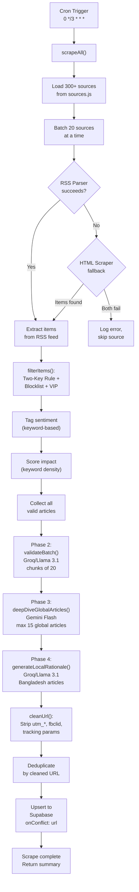
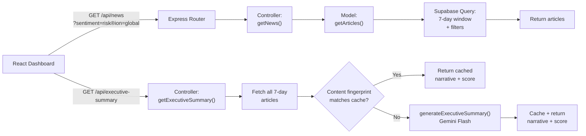

# BD Investment Newsfeed — Complete Technical Reference

> **Purpose:** Personal study reference.
>
> **Last Updated:** 2026-07-07

---

## Table of Contents

1. [Executive Overview](#1-executive-overview)
2. [System Architecture Deep-Dive](#2-system-architecture-deep-dive)
3. [The AI Pipeline — The Heart of the Project](#3-the-ai-pipeline--the-heart-of-the-project)
4. [Prompt Engineering Showcase](#4-prompt-engineering-showcase)
5. [Data Flow Diagram](#5-data-flow-diagram)
6. [Frontend Architecture](#6-frontend-architecture)
7. [Reconstructed Vibecoding Timeline](#7-reconstructed-vibecoding-timeline)
8. [Key Design Decisions & Trade-offs](#8-key-design-decisions--trade-offs)
9. [Instructor Q&A Prep](#9-instructor-qa-prep)
10. [Conditional Email Alert System](#10-conditional-email-alert-system)

---

## 1. Executive Overview

### What It Is

**BD Investment Newsfeed** is an AI-augmented internal intelligence dashboard built for Bangladesh's three key investment promotion agencies: **BIDA** (Bangladesh Investment Development Authority), **BEZA** (Bangladesh Economic Zones Authority), and **PPPA** (Public-Private Partnership Authority).

### The Core Problem: "Narrative Lag"

International media coverage shapes foreign investor perception of Bangladesh. When a niche financial journal publishes a critique of Bangladesh's tax policy or infrastructure delays, local agencies are often the **last to know** — sometimes days later. By then, misinformation may have already deterred potential FDI (Foreign Direct Investment). Conversely, positive coverage often goes uncapitalized.

**Current state (without this tool):**
- PR teams manually scan Reuters/Bloomberg or rely on WhatsApp link-sharing
- No unified view of "what the world is saying about us today"
- Raw headlines without context on *why* a story matters or *what* to do about it

### What This Tool Does

It operates as a **24/7 automated intelligence pipeline** that:

1. **Scrapes 100+ international RSS sources** every 3 hours across all time zones
2. **Filters for relevance** using a multi-stage keyword + AI validation funnel
3. **Classifies sentiment** (Opportunity / Risk / Regulation) and **scores impact** (0–100)
4. **Generates AI intelligence notes** explaining how Bangladesh is being portrayed
5. **Produces an executive climate summary** — a 2-sentence brief with a weighted confidence score
6. **Surfaces everything on a real-time dashboard** where officials can log responses, export reports, and share signals

### Key Numbers

| Metric | Value |
|---|---|
| RSS sources monitored | 300+ across 40+ countries |
| Scrape frequency | Every 3 hours (cron) |
| AI models used | 2 (Groq/Llama 3.1 + Google Gemini Flash) |
| Dashboard retention | 7-day rolling window |
| Archive retention | 60 days in Supabase |
| API keys rotated | 3 Gemini + 2 Groq |

---

## 2. System Architecture Deep-Dive

### High-Level Architecture

```
┌────────────────────────────────────────────────────────────────────────┐
│                        DATA INGESTION LAYER                          │
│                                                                      │
│  300+ RSS Sources ──► rss-parser ──► HTML Fallback (cheerio)         │
│  (sources.js)         (scraper.js)   (htmlScraper.js)                │
└─────────────────────────────────┬────────────────────────────────────┘
                                  │ Raw articles
                                  ▼
┌────────────────────────────────────────────────────────────────────────┐
│                     INTELLIGENCE PROCESSING LAYER                    │
│                                                                      │
│  Phase 1: Keyword Filter (analyzer.js)                               │
│      "Two-Key Rule" + VIP pass + Blocklist                          │
│                           │                                          │
│  Phase 2: AI Semantic Validation (aiValidator.js)                    │
│      Groq/Llama 3.1 — batch classification + impact scoring         │
│                           │                                          │
│  Phase 3: Deep-Dive Intelligence (aiValidator.js)                    │
│      Gemini Flash — full-text extraction + narrative framing         │
│      articleExtractor.js: Readability → Cheerio fallback            │
│                           │                                          │
│  Phase 4: Local Rationale (aiValidator.js)                           │
│      Groq/Llama 3.1 — lightweight intelligence notes                │
│                           │                                          │
│  Phase 5: Dedup + Save                                               │
│      URL-based deduplication → Supabase upsert                      │
└─────────────────────────────────┬────────────────────────────────────┘
                                  │ Validated, enriched articles
                                  ▼
┌────────────────────────────────────────────────────────────────────────┐
│                        DATA PERSISTENCE LAYER                        │
│                                                                      │
│  Supabase (PostgreSQL)                                               │
│  Table: news_articles                                                │
│  Fields: id, title, url, source, snippet, sentiment, impact_score,  │
│          region, ai_rationale, published_at, action_taken,           │
│          action_note, created_at                                     │
│                                                                      │
│  Retention: 7-day dashboard window │ 60-day archive │ daily purge   │
└─────────────────────────────────┬────────────────────────────────────┘
                                  │ REST API (Express.js)
                                  ▼
┌────────────────────────────────────────────────────────────────────────┐
│                       PRESENTATION LAYER                             │
│                                                                      │
│  React 18 + Vite + TypeScript + Tailwind CSS + shadcn/ui            │
│                                                                      │
│  Key Views:                                                          │
│  ├── AI Climate Pulse (executive summary + confidence score)        │
│  ├── Summary Stats (opportunity/risk/regulation counts)             │
│  ├── News Feed Grid (cards with sentiment badges + AI notes)        │
│  ├── Filter Bar (sentiment × magnitude × region, multi-select)      │
│  ├── Action Drawer (side panel for logging responses)               │
│  └── Critical Alert Banner (top-of-page risk warning)               │
│                                                                      │
│  Deployed: Frontend on Vercel │ Backend on Render                   │
└────────────────────────────────────────────────────────────────────────┘
```

### File-Level Map

#### Server ([server/](file:///c:/Users/USER/.gemini/antigravity-ide/scratch/bd-investment-newsfeed/server))

| File | Role |
|---|---|
| [server.js](file:///c:/Users/USER/.gemini/antigravity-ide/scratch/bd-investment-newsfeed/server/server.js) | HTTP entry point. Loads `.env`, starts Express on port 5002. |
| [app.js](file:///c:/Users/USER/.gemini/antigravity-ide/scratch/bd-investment-newsfeed/server/app.js) | Express app. Mounts routes, registers two cron jobs (3-hour scrape, midnight purge). Configures restricted CORS origin whitelist via `FRONTEND_URL`. |
| [config/database.js](file:///c:/Users/USER/.gemini/antigravity-ide/scratch/bd-investment-newsfeed/server/config/database.js) | Supabase client. Validates credentials, gracefully warns if unconfigured. |
| [config/001_create_alert_subscriptions.sql](file:///c:/Users/USER/.gemini/antigravity-ide/scratch/bd-investment-newsfeed/server/config/001_create_alert_subscriptions.sql) | SQL schema file creating the `alert_subscriptions` table in Supabase. |
| [routes/index.js](file:///c:/Users/USER/.gemini/antigravity-ide/scratch/bd-investment-newsfeed/server/routes/index.js) | REST API routes: `GET /api/news`, `POST /api/alerts/subscribe`, `DELETE /api/alerts/unsubscribe`, etc. |
| [controllers/index.js](file:///c:/Users/USER/.gemini/antigravity-ide/scratch/bd-investment-newsfeed/server/controllers/index.js) | Route handlers. Bridges HTTP requests to models/services. Handles email registration and deletion requests. |
| [models/index.js](file:///c:/Users/USER/.gemini/antigravity-ide/scratch/bd-investment-newsfeed/server/models/index.js) | Supabase data access. Includes `subscribeEmail()`, `getActiveSubscriptions()`, `updateSubscriptionTrigger()`, and `unsubscribeEmail()`. |
| [services/scraper.js](file:///c:/Users/USER/.gemini/antigravity-ide/scratch/bd-investment-newsfeed/server/services/scraper.js) | Orchestrator. Drives the full pipeline: RSS → filter → AI gauntlet → dedup → save. |
| [services/analyzer.js](file:///c:/Users/USER/.gemini/antigravity-ide/scratch/bd-investment-newsfeed/server/services/analyzer.js) | Keyword-based relevance filter + rule-based sentiment tagger + impact scorer. |
| [services/aiValidator.js](file:///c:/Users/USER/.gemini/antigravity-ide/scratch/bd-investment-newsfeed/server/services/aiValidator.js) | **The AI brain.** Contains all LLM interactions: batch validation, deep-dive, local rationale, executive summary. |
| [services/articleExtractor.js](file:///c:/Users/USER/.gemini/antigravity-ide/scratch/bd-investment-newsfeed/server/services/articleExtractor.js) | Full-text extraction for deep-dive. Uses Mozilla Readability (Reader View engine) with Cheerio fallback. |
| [services/htmlScraper.js](file:///c:/Users/USER/.gemini/antigravity-ide/scratch/bd-investment-newsfeed/server/services/htmlScraper.js) | HTML scraping fallback for sources without RSS feeds. Extracts headlines from raw HTML. |
| [services/sources.js](file:///c:/Users/USER/.gemini/antigravity-ide/scratch/bd-investment-newsfeed/server/services/sources.js) | Auto-generated array of 300+ active RSS source objects `{name, url, region}`. |
| [services/emailService.js](file:///c:/Users/USER/.gemini/antigravity-ide/scratch/bd-investment-newsfeed/server/services/emailService.js) | Webhook dispatcher service. Compiles article data into CSV string text and triggers an HTTPS POST request to an external webhook (e.g. n8n or Make.com) to bypass SMTP port blocks. |
| [services/alertDispatcher.js](file:///c:/Users/USER/.gemini/antigravity-ide/scratch/bd-investment-newsfeed/server/services/alertDispatcher.js) | Post-scrape orchestrator job. Reads subscribers, enforces the 24-hour rate limit/cooldown, and sends alerts if conditions are met. |

#### Client ([client/src/](file:///c:/Users/USER/.gemini/antigravity-ide/scratch/bd-investment-newsfeed/client/src))

| File | Role |
|---|---|
| [main.tsx](file:///c:/Users/USER/.gemini/antigravity-ide/scratch/bd-investment-newsfeed/client/src/main.tsx) | React entry point. |
| [App.tsx](file:///c:/Users/USER/.gemini/antigravity-ide/scratch/bd-investment-newsfeed/client/src/App.tsx) | Root component. Wraps everything in ThemeProvider, QueryClientProvider, Router. |
| [pages/Index.tsx](file:///c:/Users/USER/.gemini/antigravity-ide/scratch/bd-investment-newsfeed/client/src/pages/Index.tsx) | Main dashboard page. Orchestrates all components, filter state, search, CSV export. |
| [lib/api.ts](file:///c:/Users/USER/.gemini/antigravity-ide/scratch/bd-investment-newsfeed/client/src/lib/api.ts) | API service layer. Typed functions for `fetchNews`, `fetchStats`, `fetchExecutiveSummary`, `updateArticle`, `subscribeToAlerts`, and `unsubscribeFromAlerts`. |
| [data/news.ts](file:///c:/Users/USER/.gemini/antigravity-ide/scratch/bd-investment-newsfeed/client/src/data/news.ts) | TypeScript types + `toNewsItem()` mapper (API shape → component shape). |
| [hooks/use-news.ts](file:///c:/Users/USER/.gemini/antigravity-ide/scratch/bd-investment-newsfeed/client/src/hooks/use-news.ts) | React Query hooks: `useNews`, `useStats`, `useExecutiveSummary`. Auto-refetch every 2–5 minutes. |
| [components/SummaryStats.tsx](file:///c:/Users/USER/.gemini/antigravity-ide/scratch/bd-investment-newsfeed/client/src/components/SummaryStats.tsx) | AI Climate Pulse card + 3 stat cards (opportunities, risks, total). |
| [components/NewsCard.tsx](file:///c:/Users/USER/.gemini/antigravity-ide/scratch/bd-investment-newsfeed/client/src/components/NewsCard.tsx) | Individual article card with sentiment badge, AI rationale, impact bar, time ago. |
| [components/ActionDrawer.tsx](file:///c:/Users/USER/.gemini/antigravity-ide/scratch/bd-investment-newsfeed/client/src/components/ActionDrawer.tsx) | Side panel for logging agency responses (Draft Response, Mark Handled, Share Signal, Archive). |
| [components/CriticalAlertBanner.tsx](file:///c:/Users/USER/.gemini/antigravity-ide/scratch/bd-investment-newsfeed/client/src/components/CriticalAlertBanner.tsx) | Top-of-page red banner for the highest-impact risk article. |
| [components/AlertSubscribe.tsx](file:///c:/Users/USER/.gemini/antigravity-ide/scratch/bd-investment-newsfeed/client/src/components/AlertSubscribe.tsx) | Modal form widget containing client-side validation, threshold sliders, and submission handlers. |

---

## 3. The AI Pipeline — The Heart of the Project

This is the most technically interesting part of the project and the section most relevant to an LLM/Agentic AI course. The pipeline is a **5-phase intelligence funnel** that progressively filters, classifies, and enriches raw news into actionable intelligence.

### The Funnel Metaphor

```
4,000+ raw headlines (from 300+ active RSS feeds)
         │
    Phase 1: Keyword Filter (analyzer.js)
         │  ─── Rejects sports, crime, entertainment
         │  ─── Requires CONTEXT + BUSINESS keyword match
         ▼
~200-400 broad keyword matches
         │
    Phase 2: AI Semantic Validation (Groq/Llama 3.1)
         │  ─── Eliminates false positives (e.g., "Hajj logistics")
         │  ─── Classifies: opportunity / risk / regulation
         │  ─── Scores impact: 0–100
         ▼
~30-80 verified intelligence articles
         │
    Phase 3: Deep-Dive Intelligence (Gemini Flash)
         │  ─── Global articles only
         │  ─── Fetches full article text (Readability + Cheerio)
         │  ─── Generates narrative framing intelligence notes
         │  ─── Refines impact scores based on full content
         ▼
    Phase 4: Local Rationale (Groq/Llama 3.1)
         │  ─── Bangladesh-source articles only
         │  ─── Lightweight intelligence notes from title+snippet
         ▼
~30-80 fully enriched articles → Supabase
         │
    Phase 5: Executive Climate Summary (Gemini Flash / Groq)
         │  ─── On-demand (when dashboard loads)
         │  ─── Weighted confidence score (70% global, 30% local)
         │  ─── 2-sentence executive brief
         │  ─── Fallback: Groq (Llama-3.3-70b) if Gemini hits 429 quota block
         ▼
Dashboard with real-time intelligence
```

### Sentiment, Magnitude, and Impact Taxonomy Logic

This project does not rely on generic out-of-the-box sentiment analyzers. Instead, it utilizes a custom taxonomy and scoring mechanism tailored specifically to BIDA's macroeconomic mission: supporting economic growth, tracking foreign investor sentiment, and identifying systemic risks.

#### 1. Sentiment Categorization (Opportunity, Risk, or Regulation)

Articles are classified into three distinct categories. The classification aligns with the **BIDA macroeconomic perspective** (which may differ from commercial bank or sector-specific views):

*   **`opportunity` (Opportunity for Economic Growth / Foreign Investment):**
    *   *Definition:* Positive indicators that attract capital, boost FDI, improve sovereign/sector credit, or expand corporate capacity.
    *   *Macro Nuance:* If an event is good for a specific business's bottom line but harmful to overall national development, BIDA's perspective overrides. (For example, high interest rate spreads are profitable for commercial banks, but are categorized as `risk` or `regulation` because they increase borrowing costs for SMEs).
*   **`risk` (Threat to the Investment Climate):**
    *   *Definition:* Negative developments that deter foreign capital, increase operational costs, or destabilize local markets.
    *   *Scope:* Includes currency depreciation (Taka devaluation), supply chain disruption, rising sovereign debt risk, bureaucratic delay, and environmental/climate vulnerabilities.
*   **`regulation` (Policy Parameters & Compliance):**
    *   *Definition:* Neutral, factual policy announcements or regulatory frameworks that do not inherently represent a growth opportunity or an active risk, but rather define the operating rules for investors.
    *   *Scope:* Central bank rate decisions, budget allocations, customs reforms, and trade MoUs.

#### 2. Narrative Impact Score (0–100)

The narrative impact represents the gravity of the news item relative to national economic interests. It is computed in a multi-stage process:

1.  **Groq Initial AI Rating (Ingestion):** During Phase 2, the Llama model assigns a rating from `0` to `100` based on a predefined rubric:
    *   **90-100 (Systemic):** Market-moving events affecting the entire nation or billions of dollars (e.g., IMF package approval, major sovereign default risk).
    *   **70-89 (High/Sectoral):** Industry-wide impact (e.g., nationwide RMG labor strikes, bilateral trade agreements).
    *   **50-69 (Moderate):** Notable news with limited scope (e.g., single-factory closures, regional infrastructure projects).
    *   **30-49 (Low):** Minor/routine announcements (e.g., individual corporate earnings reports).
    *   **0-29 (Minimal):** Marginally relevant local updates.
2.  **Gemini Deep-Dive Refinement (International Press):** For global news, Gemini Flash reads the full extracted text (not just the snippet) and adjusts the score upward or downward based on how heavily the framing shapes international investor perception.
3.  **Rule-Based Fallback:** If the AI services are offline, a fallback baseline score is computed in [analyzer.js](file:///c:/Users/USER/.gemini/antigravity-ide/scratch/bd-investment-newsfeed/server/services/analyzer.js#L138-L148) starting at a base of `40` and adding `6` points for every positive/negative keyword hit, capped at a maximum of `98`.

#### 3. Dynamic Magnitude Categorization

On the client-facing dashboard, the numerical `impact_score` is translated into one of four distinct magnitudes of risk or opportunity:

*   **Systemic:** `impact_score` $\ge$ **`90`** (Urgent, nation-level or market-moving signals).
*   **Sectoral:** `impact_score` is between **`70` and `89`** (High impact affecting entire sectors or industries).
*   **Notable:** `impact_score` is between **`30` and `69`** (Moderate/low localized or single-company signals).
*   **Routine:** `impact_score` $\le$ **`29`** (Routine administrative or minor corporate announcements).

### Phase 1: Keyword-Based Relevance Filter

**File:** [analyzer.js](file:///c:/Users/USER/.gemini/antigravity-ide/scratch/bd-investment-newsfeed/server/services/analyzer.js)
**Purpose:** Fast, zero-cost pre-filter to reduce 4,000+ headlines to ~200–400 broad matches before any API calls are made.

#### The "Two-Key Rule"

An article must contain **at least one CONTEXT keyword AND at least one BUSINESS keyword** to pass:

| Keyword Category | Examples | Purpose |
|---|---|---|
| **CONTEXT** (16 keywords) | `bangladesh`, `dhaka`, `chittagong`, `taka`, `bdt` | Ensures Bangladesh relevance |
| **BUSINESS** (40+ keywords) | `investment`, `fdi`, `export`, `garment`, `gdp`, `imf` | Ensures economic/investment focus |
| **VIP** (11 keywords) | `bida`, `beza`, `pppa`, `matarbari`, `payra` | Instant pass — these are Bangladesh-specific entities |
| **BLOCKLIST** (40+ keywords) | `cricket`, `bollywood`, `murder`, `yaba` | Hard reject — never relevant |

#### Different Logic for Local vs. Global Sources

This is a subtle but important design choice:

- **Global sources** (Reuters, Bloomberg, FT): Bangladesh **must be explicitly mentioned** in the title or snippet. A global article about "SEZ policy" without mentioning Bangladesh is irrelevant — it could be about any country's SEZ.
- **Local sources** (Daily Star, TBS, Financial Express): VIP keywords get an instant pass (BIDA/BEZA are inherently Bangladeshi), and either CONTEXT or BUSINESS keywords alone suffice since these are Bangladesh-origin publications.

```javascript
// Global: strict — Bangladesh must be named
if (region !== 'Bangladesh') {
  return hasContext && (hasBusiness || hasVIP);
}
// Local: lenient — VIP pass or either keyword category
if (hasVIP) return true;
return hasContext || hasBusiness;
```

#### Rule-Based Sentiment Fallback

Before AI classification, the analyzer assigns a baseline sentiment using keyword scoring:
- **Negative keywords** (35): `crisis`, `corruption`, `default`, `red tape`, etc.
- **Positive keywords** (30): `growth`, `boom`, `reform`, `partnership`, etc.
- Scoring: Count keyword hits for each → higher count wins. Default is `regulation` (neutral).
- This is a **fallback** — the AI classification in Phase 2 overrides it.

### Phase 2: AI Semantic Validation (Groq / Llama 3.1)

**File:** [aiValidator.js](file:///c:/Users/USER/.gemini/antigravity-ide/scratch/bd-investment-newsfeed/server/services/aiValidator.js) — `validateBatch()`
**Model:** `llama-3.1-8b-instant` via Groq API
**Purpose:** Eliminate false positives that passed the keyword filter and apply proper AI classification.

#### Why Groq (Not Gemini) for This Phase

Groq is used here because:
1. **Speed**: Groq's LPU architecture delivers inference at ~500 tokens/sec — critical when processing hundreds of headlines per scrape cycle
2. **Cost**: Free tier supports the volume needed
3. **Good enough**: For binary relevance validation + simple classification, an 8B parameter model is sufficient

#### Batch Processing Strategy

Articles are processed in chunks of 20. Each chunk gets a single API call containing all 20 headlines with their snippets. The prompt asks the model to:
1. **DECIDE** relevance (include or exclude)
2. **CLASSIFY** sentiment into exactly one category: `opportunity`, `risk`, or `regulation`
3. **SCORE** impact from 0–100

The response is a JSON array — only articles the model deems relevant are included. This means irrelevant articles are "rejected by omission."

Each Groq completion is configured with `max_tokens: 1000` to cap token consumption per chunk, preventing verbose model outputs from inflating costs or exceeding rate limits.

#### API Key Rotation

Two Groq API keys are rotated per chunk to spread rate limits:

```javascript
function getRotatedGroq() {
  const keys = [process.env.GROQ_API_KEY_1, process.env.GROQ_API_KEY_2];
  const keyIdx = currentGroqIndex % keys.length;
  currentGroqIndex++;
  return new Groq({ apiKey: keys[keyIdx] });
}
```

#### Error Resilience

A `retryWithBackoff` function catches 429 (rate limit) and 503 (overloaded) errors specifically, retrying up to 3 times with exponential delays (5s → 10s → 20s). Non-retryable errors (bad prompts, auth failures) fail immediately.

If an entire chunk fails even after retries, it is **skipped** ("Skipping failure chunk to prevent db pollution") rather than crashing the scrape.

#### Safe JSON Parsing (`parseJsonArraySafe`)

LLMs don't always produce clean JSON despite prompt instructions. A centralized `parseJsonArraySafe()` utility handles all known failure modes through a cascading fallback chain:

1. **Markdown fences** — strips ` ```json ` / ` ``` ` wrappers
2. **Wrapped objects** — extracts arrays from `{"results": [...]}` style wrappers
3. **Single quotes** — replaces `'` with `"` for Python-style JSON
4. **Regex extraction** — finds `[{...}]` patterns embedded in conversational text
5. **Partial recovery** — for truncated outputs (mid-stream `max_tokens` cutoff), extracts all complete `{...}` object blocks individually

This replaces the previous raw `JSON.parse()` approach, which silently discarded entire batches on any parse error.

### Phase 3: Deep-Dive Intelligence (Gemini Flash)

**File:** [aiValidator.js](file:///c:/Users/USER/.gemini/antigravity-ide/scratch/bd-investment-newsfeed/server/services/aiValidator.js) — `deepDiveGlobalArticles()`
**Model:** `gemini-flash-latest` via Google Generative AI API
**Purpose:** For the most strategically important articles (international press), fetch the full article text and generate a narrative intelligence note.

#### Why This Phase Only Applies to Global Articles

The key question for BIDA/BEZA officials is: **"How is Bangladesh being portrayed internationally?"** A local Bangladeshi newspaper reporting on infrastructure is expected. But when Reuters or Nikkei Asia writes about Bangladesh, the *framing* and *tone* matter enormously for foreign investor perception.

#### Full-Text Extraction Pipeline

Before Gemini can analyze an article, we need the full text (RSS only provides headlines and snippets). This is handled by [articleExtractor.js](file:///c:/Users/USER/.gemini/antigravity-ide/scratch/bd-investment-newsfeed/server/services/articleExtractor.js):

```
URL → Fetch HTML (Chrome UA first, Googlebot UA fallback)
         │
    Try: Mozilla Readability (same engine as Firefox/Safari "Reader View")
         │  ─── Works on well-structured news sites
         │  ─── Requires >200 chars of extracted text
         │
    Fallback: Cheerio DOM parsing
         │  ─── Searches for <article>, .article-body, [itemprop="articleBody"]
         │  ─── Strips nav, sidebar, ads, social widgets
         │  ─── Falls back to all <p> tags with >40 chars
         │
    Output: Up to 10,000 chars of clean article text
```

The dual-user-agent strategy (Chrome UA → Googlebot UA) helps bypass soft paywalls on financial sites — many sites serve full content to Googlebot for SEO indexing.

#### Intelligence Note Generation

Up to 15 global articles are deep-dived per scrape. Each gets a max-20-word intelligence note focused on **narrative framing** — not just what the article says, but *how* it says it. The prompt explicitly asks:

> "How is Bangladesh being presented? Is the tone confident, cautious, critical, or promotional?"

Impact scores are also refined based on full content — a headline that sounds mild might contain devastating analysis, or vice versa.

### Phase 4: Local Rationale (Groq / Llama 3.1)

**File:** [aiValidator.js](file:///c:/Users/USER/.gemini/antigravity-ide/scratch/bd-investment-newsfeed/server/services/aiValidator.js) — `generateLocalRationale()`
**Model:** `llama-3.1-8b-instant` via Groq API
**Purpose:** Generate short intelligence notes for Bangladeshi-source articles without the expense of full-text extraction.

#### Cost Optimization Design

Local articles don't need full-text extraction because:
1. Local news sites are often behind aggressive paywalls or have poor HTML structure
2. The *portrayal framing* question doesn't apply — these are domestic publications
3. Title + snippet provides sufficient context for a practical business implication note

The prompt asks for max-15-word notes focusing on "who is affected and what changes" — pure operational context. Each Groq completion is configured with `max_tokens: 1500` (slightly higher than validation because rationale strings are longer) to prevent runaway token consumption.

### Phase 5: Executive Climate Summary (Gemini Flash)

**File:** [aiValidator.js](file:///c:/Users/USER/.gemini/antigravity-ide/scratch/bd-investment-newsfeed/server/services/aiValidator.js) — `generateExecutiveSummary()`
**Model:** `gemini-flash-latest` via Google Generative AI API
**Purpose:** Synthesize all articles in the 7-day window into a 2-sentence executive brief + weighted confidence score.

#### The Weighted Confidence Score Formula

This is a custom algorithm, not an off-the-shelf metric:

```
For each group (global / local):
  Group Score = (opportunity_weight + regulation_weight × 0.5) / total_weight × 100

  Where weight = article's impact_score (or default 40)
  Regulation gets 0.5× because it's neutral — not positive, not negative

Final Score = Global Score × 0.70 + Local Score × 0.30
```

**Why 70% Global / 30% Local?** International perception has outsized impact on FDI decisions. A negative Bloomberg article reaches thousands of fund managers; a positive Daily Star article reaches mostly domestic readers. The 70/30 split reflects this asymmetry.

#### Content-Based Caching

The executive summary endpoint is expensive — each call triggers a Gemini API request. With React Query's 5-minute `refetchInterval`, every open dashboard tab generates ~12 Gemini calls per hour. To prevent unnecessary API exhaustion, the endpoint uses a **content-based in-memory cache**:

1. A fingerprint is computed from a sorted hash of all current article IDs
2. If the fingerprint matches the cached summary, the cached result is returned instantly (no Gemini call)
3. The cache only invalidates when the underlying article set actually changes (new scrape adds/removes articles)

This means 10 users with 5 tabs each would generate exactly **1 Gemini call** per article-set change, not 600 per hour.

#### The Executive Brief Prompt

The prompt feeds Gemini:
- Article counts by sentiment
- The pre-computed weighted confidence score (the 70/30 formula is applied in code, **not** exposed to the model to prevent internal metric leakage)
- Top 8 highest-impact global articles with their AI intelligence notes

And asks for exactly 2 sentences:
- **Sentence 1**: Overall climate + WHY (prioritize international narrative)
- **Sentence 2**: Single most important global signal or risk

Critical anti-leak instructions explicitly forbid the model from mentioning scoring formulas, weight splits, or system indicators — ensuring the dashboard narrative reads as pure market commentary, not a technical readout.

---

## 4. Prompt Engineering Showcase

This section breaks down every AI prompt in the codebase with annotations on **what makes each prompt effective** (or notable).

### Prompt 1: The Validation System Prompt

**Location:** [aiValidator.js L83–L107](file:///c:/Users/USER/.gemini/antigravity-ide/scratch/bd-investment-newsfeed/server/services/aiValidator.js#L83-L107)
**Used by:** `validateBatch()` (Groq/Llama 3.1)

```
# IDENTITY
You are an elite financial intelligence analyst at the Bangladesh Investment
Development Authority (BIDA).

# TASK
For each headline, you must:
1. DECIDE if it is relevant business/economic/investment news about Bangladesh.
2. CLASSIFY every relevant article into exactly one sentiment category.
3. ASSIGN an impact score (0-100).

# SENTIMENT TAXONOMY
- "opportunity" — Positive investment signals: FDI announcements, export growth...
- "risk" — Threats and warning signals: inflation spikes, currency depreciation...
- "regulation" — Government/policy developments: new tax rules, central bank rate...

# IMPACT SCORING (0-100)
- 90-100: Market-moving. Affects billions (sovereign default risk, mega-FDI).
- 70-89: High. Sector-wide implications (trade agreement, major policy reform).
- 50-69: Moderate. Notable but limited scope (single company, regional infra).
- 30-49: Low. Minor/routine (small product launch, quarterly report).
- 0-29: Minimal. Marginal relevance.

# REJECTION RULES
EXCLUDE: religion, general politics without economic impact, crime, entertainment,
sports, lifestyle, international news passively mentioning Bangladesh.
```

**Prompt Engineering Techniques:**
1. **Role assignment** ("elite financial intelligence analyst at BIDA") — grounds the model in domain expertise
2. **Structured taxonomy** with concrete examples — prevents ambiguous classifications
3. **Calibrated rubric** with dollar-amount anchors ("Affects billions") — ensures consistent scoring across runs
4. **Explicit rejection rules** — prevents common false positives (religious news, passive mentions)
5. **Output format constraint** — the prompt provides an explicit example array (`[{"id": 0, "sentiment": "opportunity", "impact": 85}, ...]`) and explicitly forbids markdown fences, outer wrapper objects, and commentary. This is paired with the `parseJsonArraySafe` utility as a defense-in-depth strategy

### Prompt 2: Deep-Dive Narrative Analysis

**Location:** [aiValidator.js L210–L224](file:///c:/Users/USER/.gemini/antigravity-ide/scratch/bd-investment-newsfeed/server/services/aiValidator.js#L210-L224)
**Used by:** `deepDiveGlobalArticles()` (Gemini Flash)

```
You are analyzing how international media portrays Bangladesh's investment and
economic landscape. For each article below:

1. Write an "Intelligence Note" (max 20 words) that captures the NARRATIVE
   FRAMING — how is Bangladesh being presented? Is the tone confident, cautious,
   critical, or promotional? What is the key takeaway for a Bangladeshi investment
   authority monitoring global perception?

2. Refine the impact score based on the full article content. A global article
   that reaches a wide international audience and shapes foreign investor
   perception should score higher than its headline alone might suggest.
```

**Prompt Engineering Techniques:**
1. **Perception-focused framing** — doesn't ask "what does the article say" but "how is Bangladesh *portrayed*"
2. **Explicit tone vocabulary** ("confident, cautious, critical, promotional") — gives the model a classification framework within the generation task
3. **Audience-aware scoring instruction** — "shapes foreign investor perception should score higher" — teaches the model to consider audience reach, not just content

### Prompt 3: Local Rationale

**Location:** [aiValidator.js L281–L287](file:///c:/Users/USER/.gemini/antigravity-ide/scratch/bd-investment-newsfeed/server/services/aiValidator.js#L281-L287)
**Used by:** `generateLocalRationale()` (Groq/Llama 3.1)

```
For each Bangladesh business news headline below, write a concise intelligence
note (max 15 words) explaining the practical business implication. Focus on who
is affected and what changes.
```

**Prompt Engineering Techniques:**
1. **Extreme brevity constraint** (15 words) — forces the model to distill to essence
2. **Action-oriented framing** ("who is affected and what changes") — prevents generic summaries
3. **Minimal prompt size** — appropriate for the lightweight Groq/Llama model and the lower-stakes task
4. **Strict format enforcement** — explicit instructions to avoid markdown syntax, outer wrapper objects, and commentary, matching the defensive parsing strategy used across all AI prompts

### Prompt 4: Executive Climate Summary

**Location:** [aiValidator.js L469–L488](file:///c:/Users/USER/.gemini/antigravity-ide/scratch/bd-investment-newsfeed/server/services/aiValidator.js#L469-L488)
**Used by:** `generateExecutiveSummary()` (Gemini Flash)

```
You are writing a 2-sentence executive intelligence brief for the BIDA dashboard.
The assessment must be heavily driven by international perception.

7-day snapshot:
- Total: {N} articles ({N} international, {N} local)
- Opportunities: {N} | Risks: {N} | Regulation: {N}
- Current Climate Sentiment Score: {N}/100

Key International Narratives (Focus heavily on these intelligent notes):
{Top 8 global articles with AI notes}

Write exactly 2 sentences:
Sentence 1: State the overall investment climate and WHY, prioritizing international narrative.
Sentence 2: Highlight the single most important global signal or risk for foreign investors.

CRITICAL INSTRUCTIONS:
- Be specific. No fluff. No labels (do not write "Sentence 1:", "Sentence 2:", etc.).
- Output ONLY the 2 sentences.
- Do NOT mention any internal scoring formulas, weight splits (e.g., 70% or 30%),
  or system indicators. Focus purely on describing the economic and investment
  landscape itself.
```

**Prompt Engineering Techniques:**
1. **Data-grounded generation** — provides exact counts and the confidence score, preventing hallucinated statistics
2. **Hierarchical context** — feeds the model pre-processed AI intelligence notes, creating a "chain of AI reasoning" (Phase 2 notes → Phase 5 synthesis)
3. **Structural constraint** ("exactly 2 sentences") — prevents wall-of-text executive summaries
4. **Anti-fluff instruction** ("Be specific. No fluff. No labels.") — prevents outputs like "Sentence 1: The climate is..."
5. **Sentence-level task assignment** — each sentence has a defined purpose, reducing ambiguity
6. **Internal metric leak prevention** — the 70/30 formula is computed in code and only the final score is passed to the model as "Current Climate Sentiment Score." An explicit anti-leak instruction forbids the model from mentioning scoring formulas or weight splits, ensuring the output reads as natural market commentary

---

## 5. Data Flow Diagram

### End-to-End Scrape Cycle (Every 3 Hours)



### Dashboard Request Flow



### Data Retention Strategy

```
Day 0 ──────────────────── Day 7 ──────────────────── Day 60
  │                          │                          │
  │◄── Dashboard Window ───►│                          │
  │   (visible to users)     │                          │
  │                          │◄── Archive Only ────────►│
  │                          │   (in Supabase, not      │
  │                          │    shown on dashboard)   │
  │                          │                          │
  │                          │                          ├── Purged
  │                          │                          │   (daily midnight cron)
```

**Important nuance:** The 7-day window is anchored to `created_at` (when the scraper ingested the article), **not** `published_at` (when the source originally wrote it). This means if a 3-day-old article is discovered for the first time today, it gets a full 7 days of visibility from today — not just 4 remaining days.

---

## 6. Frontend Architecture

### Tech Stack

| Layer | Technology | Purpose |
|---|---|---|
| Framework | React 18 + Vite | Fast dev server, HMR, TypeScript |
| Styling | Tailwind CSS + shadcn/ui | Design system implementation |
| Data Fetching | @tanstack/react-query | Caching, auto-refetch, query invalidation |
| Icons | Lucide React | Consistent icon set (2px stroke) |
| Theming | Custom ThemeProvider | Dark/light/system mode |
| Deployment | Vercel | Static hosting + API proxy rewrites |

### Design System Implementation

The design system from the PRD is implemented through CSS custom properties in [index.css](file:///c:/Users/USER/.gemini/antigravity-ide/scratch/bd-investment-newsfeed/client/src/index.css):

| Design Token | Light Mode | Dark Mode | Usage |
|---|---|---|---|
| `--primary` | Copper Green (#527F76) | Lighter Copper Green | Authority, CTAs, focus rings |
| `--destructive` | National Red (#F42A41) | Same | Risk alerts, critical badges |
| `--positive` | Emerald 500 | Same | Opportunity badges |
| `--neutral` | Amber 500 | Same | Regulation/policy badges |

**Typography:**
- **Primary**: Sora — used globally for UI, headings, and copy
- **Mono**: JetBrains Mono — used for metadata, scores, timestamps, sentiment labels

### Component Hierarchy

```
App (ThemeProvider → QueryClientProvider → Router)
└── Index (main page)
    ├── CriticalAlertBanner — highest-impact risk article, red top bar
    ├── DashboardHeader — logo, search input, theme toggle
    ├── SummaryStats
    │   ├── AI Climate Pulse — executive brief + confidence score bar
    │   └── 3× stat cards (Opportunities, Risk Alerts, Total Articles)
    ├── Filter Bar — 3 multi-select filter groups
    │   ├── Sentiment: Opportunity / Risk / Regulation
    │   ├── Magnitude: Systemic / Sectoral / Notable / Routine
    │   └── Source: Local Media / Global Insights
    └── NewsCard[] — grid of article cards (links directly to source URL)
        ├── SentimentBadge (colored label)
        ├── AI Rationale (sparkle icon + note)
        └── Impact bar (visual + numeric score)
```

### Key UX Patterns

1. **Multi-select filters with URL-synced state**: Selecting "Risk" + "Opportunity" shows both — empty selection shows all. Filter values are passed as comma-separated query params to the API.

2. **Debounced search**: Search input uses a 500ms debounce hook to avoid hammering the API on every keystroke. The backend queries both `title` and `snippet` fields using a Supabase `OR` filter, so articles mentioning a keyword only in the body text are no longer missed.

3. **Auto-refetch**: News articles refresh every 2 minutes; executive summary every 5 minutes. The executive summary is backed by a content-based in-memory cache on the server, so repeated polls only trigger a Gemini API call when the underlying article set actually changes.

4. **Optimistic placeholders**: `placeholderData: (prev) => prev` in React Query keeps showing old data while new data loads — no loading flicker on filter changes.

5. **CSV export**: One-click export of all visible articles as a CSV file with headers: Title, Date, Source, Sentiment, Impact, Region, URL. All field values are wrapped through a centralized `escapeCSV()` helper that double-quote-wraps every cell and escapes internal quotes (`"` → `""`), preventing corrupted rows from titles containing commas (e.g., *"Bangladesh GDP grows, experts say"*). The downloaded filename dynamically reflects active filters — for example, `bd-investment-news-global-risk-2026-07-08.csv` — so users can immediately distinguish between filtered subsets and full exports.

6. **Direct source linking**: News cards behave as HTML anchor links that open the original publisher's URL in a new browser tab (`target="_blank"`). This provides immediate full-text reading context for BIDA officials, removing the need for a secondary side drawer. The red top banner's "View Impact →" button similarly links directly to the target article's original webpage.

7. **Executive summary resilience**: The SummaryStats component handles three distinct UI states: a skeleton loader during initial fetch, a graceful fallback message ("Climate assessment temporarily unavailable") on API errors with auto-retry via the background polling cycle, and the rendered AI narrative on success.

### Deployment Configuration

The frontend is deployed on **Vercel** and the backend on **Render** (inferred from [vercel.json](file:///c:/Users/USER/.gemini/antigravity-ide/scratch/bd-investment-newsfeed/client/vercel.json)):

```json
{
  "rewrites": [{
    "source": "/api/:path*",
    "destination": "https://bd-investment-newsfeed.onrender.com/api/:path*"
  }]
}
```

In development, Vite's built-in proxy handles the same routing (`/api → localhost:5002`).

---

## 7. Reconstructed Vibecoding Timeline

> [!NOTE]
> This section reconstructs the likely development process based on codebase evidence, corrected by your confirmed chronology. The phases below reflect the order you actually built things.

### Phase 1: PRD & Design System (Foundation)

**What happened:** You started by writing (or prompting an AI to write) a detailed Product Requirements Document and Design System specification.

**Evidence:**
- [PRD - BD Investment Newsfeed.md](file:///c:/Users/USER/.gemini/antigravity-ide/scratch/bd-investment-newsfeed/docs/PRD%20-%20BD%20Investment%20Newsfeed.md) — 110-line doc with executive summary, competitive analysis, target audience, success metrics
- [Design System - BD Investment Newsfeed.md](file:///c:/Users/USER/.gemini/antigravity-ide/scratch/bd-investment-newsfeed/docs/Design%20System%20-%20BD%20Investment%20Newsfeed.md) — Full typography scale, color palette, spacing system, component guidelines, and even a conceptual HTML layout

**Why first:** This is classic "prompt-driven development" — giving the AI a comprehensive spec before any code, so subsequent code generation is grounded in a clear vision. The PRD also shows competitive analysis against Meltwater, Factiva, and Feedly, establishing the project's differentiation.

---

### Phase 2: Frontend Scaffolding via Lovable (UI-First)

**What happened:** You used [Lovable](https://lovable.dev) (an AI app builder) to scaffold the React frontend based on the PRD and Design System docs.

**Evidence:**
- `lovable-tagger` imported in [vite.config.ts](file:///c:/Users/USER/.gemini/antigravity-ide/scratch/bd-investment-newsfeed/client/vite.config.ts) (line 4) — this is Lovable's component tracking plugin
- 49 shadcn/ui components pre-installed in `client/src/components/ui/` — Lovable auto-installs these
- The `components.json` file (shadcn configuration)
- The overall project structure follows Lovable's conventions (Vite + React + Tailwind + shadcn)

**What Lovable likely generated:**
- Project scaffold (Vite + React + TypeScript + Tailwind)
- All 49 shadcn/ui base components
- Initial page layouts matching the Design System's conceptual HTML
- Theme provider and dark mode setup

**What you likely prompted/iterated on:**
- Custom components: DashboardHeader, NewsCard, SummaryStats, ActionDrawer, CriticalAlertBanner, SentimentBadge
- The specific Gov-Tech color scheme (Copper Green, National Red)
- The filter bar UX with multi-select toggles

---

### Phase 3: Source Expansion (RSS Discovery Engine)

**What happened:** You expanded from a handful of manually-picked RSS feeds to 300+ by building an auto-discovery pipeline.

**Evidence:**
- [RSS News Source.txt](file:///c:/Users/USER/.gemini/antigravity-ide/scratch/bd-investment-newsfeed/docs/RSS%20News%20Source.txt) — a massive 33KB tab-separated file listing news portals across 40+ countries (Argentina, Australia, Azerbaijan, Bahrain, Bangladesh, Belgium, Bhutan, Brazil, Cambodia, Canada, China, etc.)
- [discover_rss.js](file:///c:/Users/USER/.gemini/antigravity-ide/scratch/bd-investment-newsfeed/server/discover_rss.js) — reads the text file, visits each site, discovers RSS `<link>` tags or guesses `/feed` URLs, then auto-generates `sources.js`
- [sources.js](file:///c:/Users/USER/.gemini/antigravity-ide/scratch/bd-investment-newsfeed/server/services/sources.js) is marked "Auto-generated by Auto-Discovery Engine" — 1,684 lines, 38KB

**The process was likely:**
1. Prompt an AI: "Give me a list of business/financial news portals for every major country"
2. Get back the tab-separated `RSS News Source.txt`
3. Build `discover_rss.js` to automate RSS feed discovery from those URLs
4. Run it → generates `sources.js` with 100+ entries
5. Many sources failed → build `fix_failed_sources.js` for manual fixes + brute-force suffix testing

---

### Phase 4: Polish Round 1 (Dark Mode, Filters, Export)

**What happened:** The frontend was refined with production-quality features.

**Evidence:**
- Dark mode CSS variables in [index.css](file:///c:/Users/USER/.gemini/antigravity-ide/scratch/bd-investment-newsfeed/client/src/index.css) (lines 67–87)
- Multi-select magnitude filters (Systemic/Sectoral/Notable/Routine) in [Index.tsx](file:///c:/Users/USER/.gemini/antigravity-ide/scratch/bd-investment-newsfeed/client/src/pages/Index.tsx)
- CSV export functionality (lines 120–140 of Index.tsx)
- Vercel deployment config for production proxy

---

### Phase 5: Express Server + Supabase + Basic RSS Scraping

**What happened:** The backend was built — Express server, Supabase connection, RSS parsing, and the keyword-based relevance filter.

**Evidence:**
- Standard MVC structure: routes → controllers → models
- Supabase upsert on URL for deduplication
- The `analyzer.js` keyword filter with its "Two-Key Rule"
- [seed.js](file:///c:/Users/USER/.gemini/antigravity-ide/scratch/bd-investment-newsfeed/server/scripts/seed.js) — sample data with old sentiment values (`critical`, `growth`, `policy`) that differ from the final AI taxonomy (`opportunity`, `risk`, `regulation`), suggesting the seed data was created before AI classification was integrated

---

### Phase 6: AI Validation Layer (Groq + Gemini Integration)

**What happened:** The dual-LLM intelligence pipeline was built — the project's core differentiator.

**Evidence:**
- [aiValidator.js](file:///c:/Users/USER/.gemini/antigravity-ide/scratch/bd-investment-newsfeed/server/services/aiValidator.js) — 411 lines, the largest service file
- API key rotation logic for both Groq (2 keys) and Gemini (3 keys)
- The batch validation → deep-dive → local rationale pipeline
- [patch_rationales.js](file:///c:/Users/USER/.gemini/antigravity-ide/scratch/bd-investment-newsfeed/server/scripts/patch_rationales.js) — backfill script for articles that existed before the AI rationale feature was added (strong evidence this was a later addition)

**The evolution is visible in the seed data:**
- `seed.js` uses `critical`/`growth`/`policy` (old taxonomy)
- `aiValidator.js` uses `opportunity`/`risk`/`regulation` (final taxonomy)
- `data/news.ts` has a `sentimentMap` that maps 1:1 (suggesting there was once a mapping between different taxonomies)

---

### Phase 7: Deep-Dive Intelligence + Executive Summary (Final AI Layer)

**What happened:** The most sophisticated AI features were added last — full-text extraction for global articles, narrative framing intelligence notes, and the executive climate summary with weighted confidence scoring.

**Evidence:**
- [articleExtractor.js](file:///c:/Users/USER/.gemini/antigravity-ide/scratch/bd-investment-newsfeed/server/services/articleExtractor.js) — the comment "REVERT: If this version causes issues, replace this file with articleExtractor.backup.js" suggests it went through iterations
- The Mozilla Readability + Cheerio dual-strategy
- The weighted confidence formula (70% global / 30% local)
- The SummaryStats component's `confidenceLabel()` function mapping scores to qualitative labels (Bullish → Bearish)

---

## 8. Key Design Decisions & Trade-offs

### Decision 1: Why a Dual-LLM Strategy (Groq + Gemini)?

| | Groq (Llama 3.1 8B) | Gemini Flash |
|---|---|---|
| **Used for** | Batch validation, local rationale | Deep-dive analysis, executive summary |
| **Speed** | ~500 tok/sec (LPU) | ~200 tok/sec |
| **Cost** | Free tier | Free tier (3 keys rotated) |
| **Context window** | 8K tokens | 1M tokens |
| **Reasoning depth** | Adequate for classification | Needed for narrative analysis |

**Trade-off:** Using a single model would be simpler but slower and more expensive. The dual-model approach matches **task complexity to model capability** — simple classification goes to the fast cheap model, nuanced analysis goes to the powerful one.

### Decision 2: Why Keyword Pre-Filter Before AI?

Without the keyword filter, every scrape cycle would send **4,000+ headlines** to AI APIs. At ~1,000 tokens per 20-headline batch, that's ~200 API calls per scrape × 8 scrapes/day = **1,600 API calls/day** — far exceeding free tier limits.

The keyword filter reduces this to ~200–400 articles, cutting API costs by **~90%** while catching the vast majority of relevant content.

**Trade-off:** A purely keyword-based filter has false positives (e.g., "Bangladesh cricket team's economic impact on tourism"). That's why the AI validation exists as Phase 2 — to catch what keywords can't.

### Decision 3: Why Supabase Over a Traditional Database?

- **Free tier**: Generous for a project of this scale
- **Instant REST API**: No need to write SQL queries — the Supabase JS client provides a fluent query builder
- **Built-in upsert**: `onConflict: 'url'` handles deduplication in a single operation
- **Hosted**: No database server management

**Trade-off:** Data sovereignty concern (mentioned in the PRD). The flat-file approach was considered as a fallback, but Supabase's convenience won for the MVP.

### Decision 4: Why `created_at` for Retention, Not `published_at`?

If an article was published 6 days ago but our scraper only found it today, using `published_at` would give it only 1 day of dashboard visibility. Using `created_at` guarantees every article gets a full 7 days of visibility from the moment it enters the system.

**Trade-off:** An article published today and one published 5 days ago (but just discovered) appear with equal visual weight. This is intentional — for intelligence purposes, "when we learned about it" matters more than "when it was written."

### Decision 5: Why 3 Gemini Keys and 2 Groq Keys?

Free-tier API rate limits are per-key. By rotating across multiple keys, the effective rate limit multiplies:
- 3 Gemini keys → 3× the requests per minute
- 2 Groq keys → 2× the requests per minute
- Different keys are used for different *purposes* (validation vs. analysis) to further spread load

**Trade-off:** Managing multiple API keys adds complexity. The rotation logic is centralized in `getRotatedModel()` and `getRotatedGroq()` to keep it maintainable.

### Decision 6: Why RSS + HTML Fallback?

Not all news sites provide RSS feeds. The [scraper.js](file:///c:/Users/USER/.gemini/antigravity-ide/scratch/bd-investment-newsfeed/server/services/scraper.js) first tries RSS parsing; if that fails, it falls back to HTML scraping using [htmlScraper.js](file:///c:/Users/USER/.gemini/antigravity-ide/scratch/bd-investment-newsfeed/server/services/htmlScraper.js).

The HTML scraper uses 3 progressive strategies:
1. Look for `<article>` tags (modern news sites)
2. Look for headline-class elements (`h2 a`, `[class*="headline"] a`)
3. Broad scan — any `<a>` with substantial text (>5 words, <30 words)

**Trade-off:** HTML scraping is fragile — site redesigns break it. RSS is reliable but not universal. The fallback approach maximizes source coverage.

### Decision 7: Why Vercel + Render (Split Deployment)?

- **Vercel** for the frontend: Optimized for static/SPA hosting, global CDN, instant deploys
- **Render** for the backend: Supports persistent Node.js processes needed for cron jobs

**Trade-off:** A monolithic deployment would be simpler. But Vercel's free tier doesn't support long-running server processes (needed for 3-hour cron scrape cycles), and Render's free tier doesn't have the CDN performance for static assets.

### Decision 8: Render Free-Tier Cron & Sleep Cycles (Keep-Alive Workaround)

Render's free tier spins down Node.js processes after 15 minutes of inactivity. When the process sleeps, standard in-app cron schedulers (like `node-cron`) stop executing. This means scheduled scraper cycles (every 3 hours) would be missed entirely unless someone happens to visit the dashboard.

**Workaround:**
To keep the database fresh and active, an external health monitoring ping was configured using **UptimeRobot**. By sending a `GET` request to `/api/health` every 14 minutes, the server is prevented from going to sleep.

**Trade-off:**
This ensures cron reliability and keeps the instance warm to eliminate the 10-30 second cold-start delays on user visits, at the expense of keeping a free-tier resource active.

### Decision 9: API Security Hardening (CORS, Route Disabling, PATCH Whitelist)

Three layers of API security were added during the diagnostic refinement phase:

1. **CORS Origin Whitelist** — `app.js` now restricts cross-origin requests to origins defined in the `FRONTEND_URL` environment variable (comma-separated list) plus localhost development ports. In `development` mode, all origins are permitted for convenience. Unknown origins receive a `Not allowed by CORS` error.
2. **Route Disabling** — The `POST /api/scrape` endpoint, which triggered a full scrape cycle, was completely disabled from the router. It had no authentication and could be invoked by anyone.
3. **PATCH Field Whitelist** — The `PATCH /api/news/:id` controller now only accepts `action_taken` and `action_note` from `req.body`, preventing attackers from injecting arbitrary field updates (e.g., overwriting `sentiment`, `impact_score`, or `ai_rationale`).

**Trade-off:** Manual scrape triggering now requires direct server access (SSH or Render dashboard). This is acceptable since the 3-hour cron handles production needs.

### Decision 10: URL Normalization for Deduplication

RSS feeds frequently append tracking parameters (`utm_source`, `utm_medium`, `fbclid`, `ref`, etc.) to article URLs. Since deduplication is URL-based (`onConflict: 'url'`), the same article with different tracking parameters was being stored multiple times.

A `cleanUrl()` helper in [scraper.js](file:///c:/Users/USER/.gemini/antigravity-ide/scratch/bd-investment-newsfeed/server/services/scraper.js) strips known tracking/analytics query parameters before ingestion, normalizing URLs to their canonical form. This runs in the `filterItems` pipeline before the in-memory `Map` dedup check and the Supabase upsert.

### Decision 11: Safe Date Parsing for RSS Feeds

RSS feeds occasionally emit malformed `pubDate` values — empty strings `""`, placeholder text like `"TBD"`, or non-standard date formats. The original code used `new Date(item.pubDate).toISOString()`, which throws a `RangeError` on invalid dates, crashing the entire source batch.

A `parseSafeDate()` helper validates the parsed date before calling `.toISOString()`. If the date is invalid, it returns `null`, and the article is stored with the current timestamp instead of crashing the pipeline.

---

## 9. Instructor Q&A Prep

### "How does the AI ensure relevance?"

**Answer:** Multi-stage funnel. First, a **zero-cost keyword filter** (the "Two-Key Rule" requiring both a CONTEXT keyword like "Bangladesh" and a BUSINESS keyword like "investment") rejects ~95% of headlines. Then, a **Groq/Llama 3.1 AI validator** batch-processes the remainder, eliminating false positives that keywords can't catch (like "Bangladesh pilgrimage logistics" which contains "Bangladesh" + "logistics" but isn't investment-relevant). Only articles that pass both gates enter the database.

### "Render's free tier sleeps after 15 minutes. How do you guarantee your 3-hour cron scrapes fire?"

**Answer:** Since in-process schedulers like `node-cron` pause when the server goes to sleep, we keep the server permanently awake using an external keep-alive ping via **UptimeRobot**. It queries the public `/api/health` endpoint every 14 minutes, keeping the Render container active 24/7 so scheduled scraper crons run reliably without interruption.

### "What happens when an API rate limit hits?"

**Answer:** Four layers of defense:
1. **Key rotation** — 3 Gemini keys and 2 Groq keys spread load across accounts
2. **Purpose-based key selection** — validation and analysis tasks use different keys
3. **Exponential backoff** — 429/503 errors trigger retries at 5s → 10s → 20s intervals
4. **Graceful degradation** — if a chunk fails after all retries, it's skipped (not saved with bad data, not crashed)
5. **Content-based caching** — the executive summary endpoint fingerprints the article set and returns cached results when unchanged, preventing the most expensive Gemini call from repeating unnecessarily
6. **Token limits** — `max_tokens` is set on Groq calls (1000 for validation, 1500 for rationale) to prevent unexpected token spikes

### "How do you handle sources without RSS?"

**Answer:** The [htmlScraper.js](file:///c:/Users/USER/.gemini/antigravity-ide/scratch/bd-investment-newsfeed/server/services/htmlScraper.js) fetches the raw HTML and uses 3 progressive DOM strategies to extract headline-like links: `<article>` tags first, then heading links, then a broad scan. It filters by word count (5–30 words) and excludes navigation-like text ("subscribe", "log in", etc.).

### "What's the sentiment classification approach?"

**Answer:** Two-layer system. **Layer 1** (keyword baseline): counts hits against 35 negative and 30 positive keywords to assign a preliminary sentiment. **Layer 2** (AI override): Groq/Llama 3.1 reclassifies into `opportunity`/`risk`/`regulation` using a detailed taxonomy prompt with concrete examples. The AI classification always overrides the keyword baseline.

### "How is the executive summary generated?"

**Answer:** It's a **chain of AI reasoning**. Phase 2 classifies and scores each article. Phase 3 generates intelligence notes for global articles. Phase 5 feeds all of this — counts, scores, the top 8 intelligence notes — into a Gemini prompt that synthesizes a 2-sentence brief. The confidence score uses a custom **weighted formula**: 70% driven by global coverage, 30% by local, because international perception has outsized impact on FDI decisions. The formula details are computed server-side and only the final score is passed to the model (labeled "Current Climate Sentiment Score") — the prompt explicitly forbids the model from mentioning scoring formulas or weight splits, preventing internal metric leakage in the dashboard output. The endpoint also uses a content-based in-memory cache: if the article set hasn't changed, the cached summary is returned without a Gemini API call.

### "What's the cost model? Is this feasible at scale?"

**Answer:** Currently operates entirely within free tiers:
- **Groq free tier**: Handles batch validation and local rationale
- **Gemini free tier**: Handles deep-dive analysis and executive summaries
- **Supabase free tier**: PostgreSQL hosting with 500MB storage
- **Vercel + Render free tiers**: Deployment hosting

The keyword pre-filter is the key cost enabler — it eliminates ~90% of articles before any API calls, keeping token usage within free-tier budgets. Key rotation (3 Gemini + 2 Groq) multiplies effective rate limits.

### "What happens if Groq or Gemini is completely down?"

**Answer:** Graceful degradation. If Groq is unavailable, `getRotatedGroq()` returns `null`, and the `validateBatch()` function skips AI validation — articles still get saved with their keyword-based sentiment and impact scores. If Gemini is unavailable or hits its 429 quota block, the executive summary generator will automatically fall back to Groq (`llama-3.3-70b-versatile` model) to synthesize the brief. If both fail, it safely returns the fallback message: "Climate assessment temporarily unavailable."


### "How does the full-text extraction work?"

**Answer:** [articleExtractor.js](file:///c:/Users/USER/.gemini/antigravity-ide/scratch/bd-investment-newsfeed/server/services/articleExtractor.js) uses **Mozilla's Readability** algorithm — the same engine behind Firefox and Safari's "Reader View." It strips ads, navigation, and boilerplate, leaving clean article text. If Readability fails (some sites have unusual HTML), it falls back to **Cheerio** DOM parsing with targeted selectors (`article`, `.article-body`, `[itemprop="articleBody"]`). It also tries two user agents: a Chrome browser UA first, then a Googlebot UA (which can bypass soft paywalls since many sites serve full content to search engine crawlers).

### "Why did you use Lovable for the frontend?"

**Answer:** Lovable is an AI-powered app builder that generates production-quality React + TypeScript + Tailwind + shadcn/ui code from natural language prompts. It was used to rapidly scaffold the frontend based on the PRD and Design System documents — turning design specifications into working components within minutes rather than days. The custom business logic (API integration, filter state management, action logging) was then built on top of this foundation.

### "What makes this different from just using Google News?"

**Answer:** Three key differentiators:
1. **Domain-specific AI filtering**: Not just "Bangladesh news" but specifically *investment/economic* news about Bangladesh, with a trained taxonomy
2. **Narrative intelligence**: AI doesn't just surface articles — it analyzes *how* Bangladesh is being portrayed (confident? cautious? critical?) and generates actionable intelligence notes
3. **Actionability**: Officials can log responses directly against articles, creating an audit trail of which narratives were addressed

### "How do you handle API security without full authentication?"

**Answer:** Three-layer defense: (1) **CORS origin whitelist** — only the production frontend URL (and localhost for dev) can make cross-origin requests, blocking arbitrary websites from calling our API. (2) **Route disabling** — dangerous endpoints like `POST /api/scrape` (which triggers a full scrape cycle) are disabled entirely from the router. (3) **Field whitelist** — the `PATCH /api/news/:id` endpoint only accepts `action_taken` and `action_note` fields, preventing attackers from overwriting AI-generated data like sentiment or impact scores.

### "What happens when the LLM returns malformed JSON?"

**Answer:** A centralized `parseJsonArraySafe()` utility handles all known failure modes through a 5-step cascading fallback: stripping markdown fences, extracting arrays from wrapper objects, replacing single quotes with double quotes, regex-extracting array patterns from conversational text, and partial object recovery for truncated outputs. This is paired with prompt-level enforcement (explicit format examples, no-markdown instructions) as a defense-in-depth strategy. The result: instead of silently dropping entire 20-article batches on a single parse error, the system recovers every valid object it can.

---

## 10. Conditional Email Alert System

To keep stakeholders automatically informed of critical shifts in investment sentiment without requiring them to actively poll the dashboard, the system features a self-managing **Conditional Email Alert System**.

### Overview
Users can subscribe by inputting their email address and defining a custom threshold score. When a scraping run finishes and calculates the updated AI climate index score:
1. The system checks if the new score falls strictly below the subscriber's threshold.
2. If it does, and the user hasn't received an alert in the last **24 hours (cooldown period)**, the system dispatches a notification payload.
3. The notification email includes:
   - A subject line containing the new climate score.
   - An HTML body displaying the latest AI Executive Summary narrative.
   - A dynamically compiled **CSV attachment** containing all active articles from the last 7 days that contributed to the score.

### Database Schema
A new table, `alert_subscriptions`, is registered in Supabase:
```sql
CREATE TABLE alert_subscriptions (
  id UUID PRIMARY KEY DEFAULT gen_random_uuid(),
  email TEXT NOT NULL,
  threshold_score INTEGER NOT NULL CHECK (threshold_score >= 0 AND threshold_score <= 100),
  created_at TIMESTAMPTZ NOT NULL DEFAULT now(),
  last_triggered_at TIMESTAMPTZ,
  last_triggered_score INTEGER,
  CONSTRAINT unique_email_threshold UNIQUE (email, threshold_score)
);
```

### Production Architecture (Generic Webhook + n8n + Gmail API)
To navigate hosting restrictions, the email alerts are dispatched through an external automation flow over standard HTTPS (Port 443):

```
┌──────────────────────────┐      JSON payload      ┌─────────────┐      Gmail API      ┌─────────────┐
│  Express Backend         ├───────────────────────►│  n8n Cloud  ├────────────────────►│ Subscriber  │
│  (emailService.js fetch) │  (toEmail, subject,   │  Webhook    │  (HTML email with   │ Inbox       │
└──────────────────────────┘   html, csvContent)    └─────────────┘   CSV attachment)   └─────────────┘
```

1. **Trigger:** The Express backend generates the alert HTML and raw CSV text, and makes a `POST` request to `ALERT_WEBHOOK_URL` containing a secure `secretToken`.
2. **n8n Webhook Node:** Receives the payload securely.
3. **n8n Code Node:** Executes a JavaScript script to convert the raw `csvContent` string into a base64-encoded binary buffer inside the workflow.
4. **n8n Gmail Node:** Connects via Google OAuth2 to compose and dispatch the email using a personal Gmail account, attaching the binary file automatically.

### Key Files & Roles
*   **[app.js](file:///c:/Users/USER/.gemini/antigravity-ide/scratch/bd-investment-newsfeed/server/app.js):** Invokes the alert check-and-dispatch process immediately following the completion of the 3-hour automated scraping job.
*   **[alertDispatcher.js](file:///c:/Users/USER/.gemini/antigravity-ide/scratch/bd-investment-newsfeed/server/services/alertDispatcher.js):** The dispatcher orchestrator. Checks active subscriptions, verifies the 24-hour rate limit, and triggers email dispatches.
*   **[emailService.js](file:///c:/Users/USER/.gemini/antigravity-ide/scratch/bd-investment-newsfeed/server/services/emailService.js):** Generates the custom HTML template with the BIDA color theme, compiles the memory-buffered articles CSV text, and performs a native `fetch()` POST request to the external webhook handler.
*   **[AlertSubscribe.tsx](file:///c:/Users/USER/.gemini/antigravity-ide/scratch/bd-investment-newsfeed/client/src/components/AlertSubscribe.tsx):** A responsive form widget with client-side email format regex checks and a custom slider that resolves scores to category labels (Routine, Notable, Sectoral, Systemic).
*   **[Index.tsx](file:///c:/Users/USER/.gemini/antigravity-ide/scratch/bd-investment-newsfeed/client/src/pages/Index.tsx):** Displays a popup Dialog modal for the subscription form, triggered by a new "Set Email Alert" button. It also checks for the `?unsubscribe` query parameter to launch the direct unsubscribe confirmation modal.

### The Unsubscribe Cycle (Option C)
To prevent friction and ensure compliance, the unsubscribe flow operates without requiring separate logins:
1. Every alert email footer contains a link dynamically built from the backend: `https://[your-app].vercel.app/?unsubscribe=[user-email]`.
2. When the user clicks the link, the React client detects the query parameter on load and automatically opens a confirmation Dialog.
3. Confirming the dialog calls `DELETE /api/alerts/unsubscribe?email=[user-email]`, removing all records matching their email from the database, and cleanses the URL parameter.

### History of Alternative Architectures & Failures

During development, multiple email sending strategies were attempted and abandoned due to specific platform and security limitations:

1. **Nodemailer SMTP (Direct Connect)**
   * *Implementation:* Configured standard SMTP connection to `smtp.gmail.com:587` using standard login credentials.
   * *Failure Mode:* Render blocks all outbound SMTP ports (25, 465, 587) on its Free Tier to prevent email spam abuse. All connection attempts threw an `ETIMEDOUT` error.
2. **Resend HTTP API**
   * *Implementation:* Swapped Nodemailer for Resend's official Node.js SDK, making requests over HTTPS (Port 443).
   * *Failure Mode:* Because the frontend was hosted on Vercel's free tier domain (`*.vercel.app`), Resend rejected the domain registration (it restricts shared/public domains to prevent reputation abuse). Sending to external subscribers on the free plan is locked until a private custom domain is verified.
3. **SendGrid Single Sender Verification (SSV)**
   * *Implementation:* Swapped Resend for SendGrid and verified a personal Gmail address via Single Sender Authentication to send to arbitrary subscribers without a custom domain.
   * *Failure Mode:* SendGrid's strict signup systems block two-factor SMS verification delivery to standard Bangladeshi phone carriers, preventing registration access.

---

## 11. LangChain Agent Chat Integration

To align with coursework requirements for LLM and Agentic AI architectures, the system features a live, conversational **BIDA AI Assistant** that operates as a reasoning agent using LangChain.

### Overview
A user can chat with the assistant directly from the dashboard via a floating chat bubble or invoke the backend endpoint at `POST /api/chat`.
1. The endpoint starts the LangChain agent using the `ChatGroq` model (`llama-3.3-70b-versatile`).
2. The agent is given explicit system instructions detailing its role as a BIDA Macro-Intelligence assistant.
3. When asked questions, the agent uses **ReAct reasoning** to dynamically determine if it needs to call external database tools, executes the tools, parses the results, and synthesizes a final response.

### Custom Tools Implemented
*   **`get_current_climate_score`:**
    *   *Purpose:* Retrieves the current national investment score and AI brief.
    *   *Mechanism:* Fetches the active article set from Supabase and invokes `generateExecutiveSummary` (which reads from the in-memory cache if hit) to return score numbers and text descriptions.
*   **`query_investment_database`:**
    *   *Purpose:* Advanced database query engine that allows searching for articles with optional key filters (sentiment, region, keyword, impact ranges, and archives).
    *   *Input:* A JSON-formatted parameters string.
    *   *Mechanism:* Directly constructs a query on Supabase, filters by date range (7 days default or 60 days if archive toggle is passed), and returns titles, sources, ingestion dates, and intelligence notes.
*   **`get_coverage_by_country`:**
    *   *Purpose:* Gets a statistical percentage breakdown of article publication counts by publishing region.
    *   *Input:* A JSON string `{ "include_archived": boolean }`.
    *   *Mechanism:* Aggregates matching articles and counts their regional occurrence, sorting them by frequency.

### Key Files & Roles
*   **[agentService.js](file:///c:/Users/USER/.gemini/antigravity-ide/scratch/bd-investment-newsfeed/server/services/agentService.js):** Builds the LangChain agent, prompt templates, tools, and execution loop.
*   **[AgentChatBubble.tsx](file:///c:/Users/USER/.gemini/antigravity-ide/scratch/bd-investment-newsfeed/client/src/components/AgentChatBubble.tsx):** Floating assistant chat drawer rendering message lists, loading indicators, and user input fields.

---


## Changelog

> This section will be updated as we polish the project.

| Date | Change | Section Updated |
|---|---|---|
| 2026-07-07 | Initial comprehensive documentation created | All |
| 2026-07-07 | Fixed executive summary rendering issues: added retry-with-backoff for Gemini calls, fixed analysis-purpose key rotation bug, and refactored UI states in SummaryStats. | Changelog, 1, 3, 6, 8 |
| 2026-07-08 | Disabled the unauthenticated public /api/scrape endpoint on the backend router for security. | Changelog, 2, 8, 9 |
| 2026-07-08 | Secured the PATCH /api/news/:id endpoint to accept only whitelisted fields (action_taken, action_note), rejecting arbitrary field updates. | Changelog, 2, 8, 9 |
| 2026-07-08 | Added safe date parsing with validation to the scraper (`published_at`), preventing crashes on malformed or empty date strings. | Changelog, 2, 8, 9 |
| 2026-07-08 | Implemented content-based in-memory caching for `/api/executive-summary` to prevent Gemini rate limit exhaustion during high traffic. | Changelog, 3, 8, 9 |
| 2026-07-08 | Added documentation about Render's free tier sleep cycles, our UptimeRobot keep-alive workaround, and a corresponding Q&A prep section. | Changelog, 8, 9 |
| 2026-07-08 | Added URL cleaning logic (`cleanUrl`) to strip tracking and analytics query parameters before ingestion, fixing duplicate articles issues. | Changelog, 2, 5, 8 |
| 2026-07-08 | Expanded dashboard search to match against both `title` and `snippet` fields, so articles mentioning search terms only in body text are no longer missed. | Changelog, 2, 6 |
| 2026-07-08 | Added a robust `parseJsonArraySafe` utility and refined batch validation, deep-dive, and local rationale LLM prompts to survive malformed/truncated JSON outputs. | Changelog, 3, 4 |
| 2026-07-08 | Configured explicit `max_tokens` limits for Groq validation (1000) and local rationale (1500) completions to prevent unexpected usage costs. | Changelog, 3, 8 |
| 2026-07-08 | Refined the executive summary LLM prompt to prevent internal metric/formula leaks and removed formula details from prompt context. | Changelog, 4, 8 |
| 2026-07-08 | Restricted CORS policy using whitelisted origins via the `FRONTEND_URL` environment variable, preventing unauthorized websites from executing API requests. | Changelog, 2, 8 |
| 2026-07-08 | Added a robust `escapeCSV` helper in the frontend (`Index.tsx`) to sanitize double quotes and commas in exported reports, preventing data alignment corruption. | Changelog, 6 |
| 2026-07-08 | Updated CSV export feature in frontend (`Index.tsx`) to dynamically append active dashboard filters (sentiment, region, magnitude, search query) to the downloaded filename. | Changelog, 6 |
| 2026-07-08 | Added SQL schema file (`001_create_alert_subscriptions.sql`) creating `alert_subscriptions` table in Supabase. | Changelog, 2, 10 |
| 2026-07-08 | Built SMTP transporter, CSV dynamic compiler, and Nodemailer email dispatch logic (`emailService.js`). | Changelog, 2, 10 |
| 2026-07-08 | Created the post-scrape conditional alert evaluation job (`alertDispatcher.js`) with 24-hour rate limit/cooldown enforcement. | Changelog, 2, 10 |
| 2026-07-08 | Implemented frontend `AlertSubscribe.tsx` form card and integrated it beside filters on dashboard page. | Changelog, 2, 6 |
| 2026-07-08 | Added backend `POST /api/alerts/subscribe` and `DELETE /api/alerts/unsubscribe` handlers to register and remove alert subscriptions. | Changelog, 2, 10 |
| 2026-07-08 | Updated Express CORS configuration (`app.js`) to dynamically authorize all `*.vercel.app` requests, resolving browser-level CORS blocks. | Changelog, 2, 8 |
| 2026-07-08 | Relocated alert subscription widget to Dialog modal, added header "Set Email Alert" button, and implemented full Option C direct unsubscribe handler. | Changelog, 6, 10 |
| 2026-07-09 | Swapped SMTP-based email dispatch with a generic HTTP Webhook trigger (`ALERT_WEBHOOK_URL`) to bypass Render SMTP port locks. | Changelog, 10 |
| 2026-07-09 | Added a robust Groq-based fallback for generating executive summaries if Google Gemini API key quota limits (429) are exceeded. | Changelog, 3, 9 |
| 2026-07-11 | Integrated LangChain Tool-Calling Agent Chat Endpoint (/api/chat) on the backend and added a floating AI Assistant chat widget on the frontend dashboard. | Changelog, 11 |

